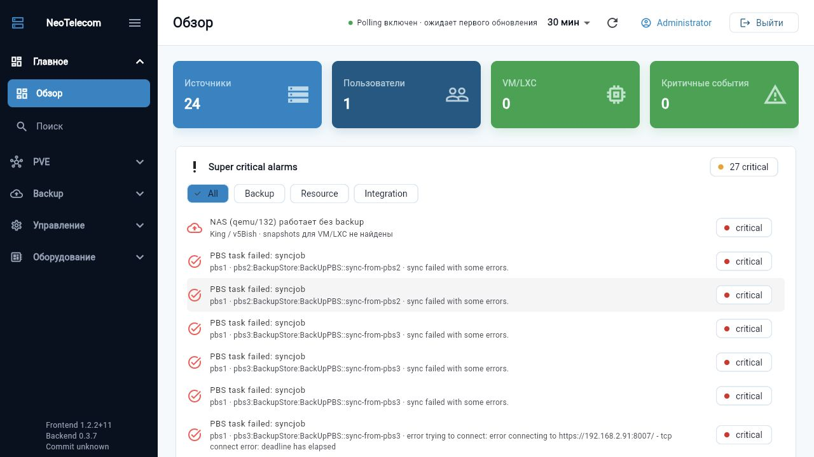
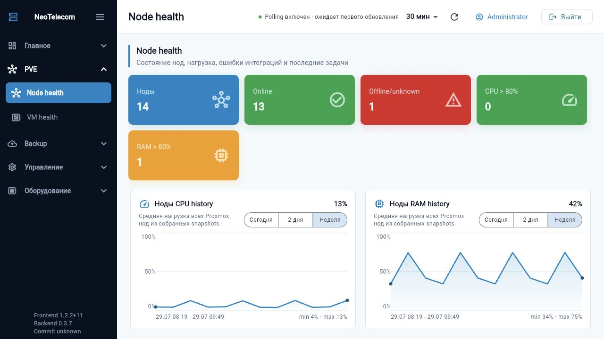
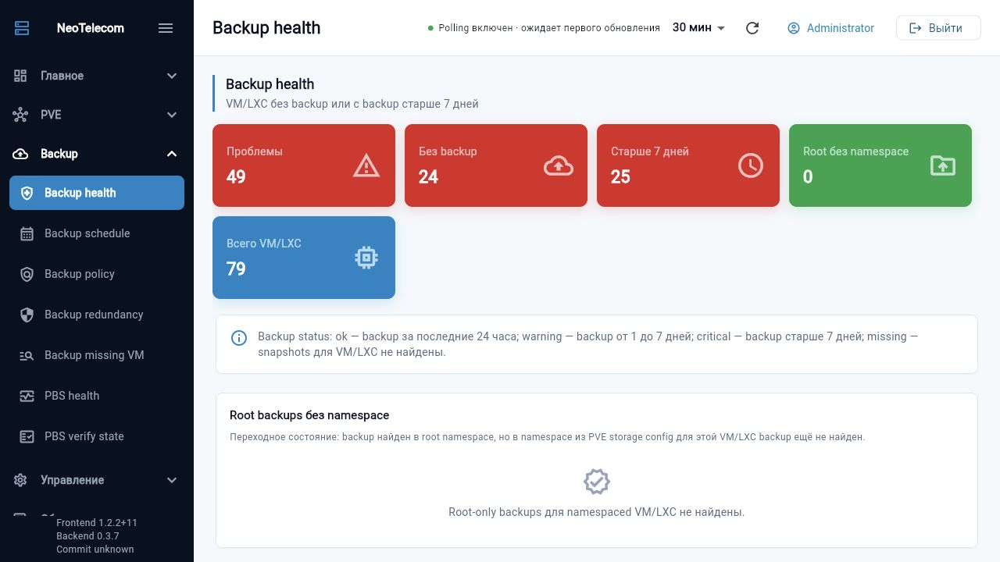

# NeoTelecom Infrastructure Dashboard

Внутренний read-only дашборд для мониторинга Proxmox VE, Proxmox Backup
Server и физических серверов. Система объединяет текущее состояние
инфраструктуры, резервные копии, аппаратный health, историю опросов и
уведомления в одном веб-интерфейсе.

## Возможности

### Proxmox VE

- обзор кластеров и нод, online/offline status;
- список QEMU VM и LXC с CPU, RAM, uptime и состоянием;
- использование storage;
- последние tasks и ошибки;
- карточки ноды и VM/LXC;
- история метрик по сохранённым snapshots;
- поиск по источникам, нодам и гостям.

### Proxmox Backup Server

- datastores, namespaces и backup snapshots;
- возраст последнего backup для каждой VM/LXC;
- поиск VM/LXC без backup;
- backup policy, schedule и redundancy analytics;
- verify, prune, sync и garbage collection jobs;
- failed tasks и заполнение datastore.

### Физические серверы

- стандартный Redfish для HPE iLO, Dell iDRAC, Huawei iBMC и совместимых BMC;
- legacy HPE iLO 2 через SSH;
- IPMI 2.0 через `ipmitool`;
- inventory, температуры, вентиляторы, питание и аппаратные health issues.

### Эксплуатация

- фоновый polling с настраиваемым интервалом 5–1440 минут;
- snapshots за последние 7 дней и метрики качества сбора;
- Telegram-уведомления о новых авариях, усилении severity и восстановлении;
- фильтр шумных ошибок до сохранения и отправки уведомлений;
- управление администраторами и блокировка пользователей;
- audit log действий;
- зашифрованное хранение credentials источников и Telegram-токена;
- PostgreSQL в production, JSON-файл для локальной разработки.

## Скриншоты

Актуальные снимки интерфейса хранятся в каталоге [`screenshots/`](screenshots/).

### Обзор и активные аварии



### Состояние Proxmox VE нод



### Состояние резервных копий



Скриншоты сделаны с боевого стенда 29.07.2026. Перед внешней публикацией
проверьте, что в кадр не попали внутренние адреса и другие служебные данные.

## Стек

| Слой | Технологии |
|---|---|
| Frontend | Flutter Web, Dart, BLoC/Cubit, GoRouter, Dio |
| Backend | Dart `HttpServer`, REST/JSON, `postgres`, `cryptography` |
| Хранилище | PostgreSQL 16; JSON storage для dev/test |
| Интеграции | Proxmox VE API, PBS API, Redfish HTTPS, SSH, IPMI 2.0 |
| Web entrypoint | Nginx: static Flutter build и reverse proxy `/api/` |
| Деплой | Docker Compose, три контейнера: frontend, backend, postgres |
| Тесты | `dart test`, `flutter test`, `flutter analyze` |

Redis и отдельная очередь сейчас не нужны: polling выполняется backend-процессом,
а PostgreSQL хранит настройки, аудит и snapshots.

## Архитектура

```text
Browser
  |
  v
Nginx :80
  |-- /          -> Flutter Web SPA
  `-- /api/*     -> Dart backend :8080
                       |-- PostgreSQL 16
                       |-- Proxmox VE / PBS API
                       |-- Redfish HTTPS
                       |-- legacy iLO 2 over SSH
                       `-- IPMI 2.0
```

Frontend никогда не получает credentials и не обращается к инфраструктуре
напрямую. Backend проверяет сессию, расшифровывает credentials только перед
запросом к источнику и отдаёт UI нормализованный JSON.

Подробная модель: [docs/architecture.md](docs/architecture.md). Правила UI:
[docs/ui-guidelines.md](docs/ui-guidelines.md).

## Структура репозитория

```text
backend/       Dart API, интеграции, polling, notifications, storage
frontend/      Flutter Web SPA
deploy/        env template и инструкция по эксплуатации
docs/          архитектура, UI guidelines и roadmap
screenshots/   актуальные снимки интерфейса
docker-compose.yml
```

## Быстрый production-деплой

Требования: Linux-сервер, Docker Engine с Compose plugin, доступ сервера к
Proxmox/BMC и внешний HTTPS reverse proxy либо закрытая доверенная сеть.

```bash
git clone <repository-url> neotelecom
cd neotelecom
cp deploy/.env.example deploy/.env
```

Перед запуском обязательно измените в `deploy/.env`:

- `POSTGRES_PASSWORD` и соответствующий пароль в `DATABASE_URL`;
- `CREDENTIALS_ENCRYPTION_KEY` — стабильный секрет длиной не менее 16 символов;
- `BOOTSTRAP_ADMIN_EMAIL` и `BOOTSTRAP_ADMIN_PASSWORD`;
- `ALLOW_INSECURE_TLS=false`, если у Proxmox/PBS/BMC доверенные сертификаты.

Запуск:

```bash
export GIT_COMMIT="$(git rev-parse --short HEAD)"
docker compose --env-file deploy/.env build
docker compose --env-file deploy/.env up -d
curl -fsS http://127.0.0.1:8081/api/health
```

Обновление:

```bash
git pull --ff-only
export GIT_COMMIT="$(git rev-parse --short HEAD)"
docker compose --env-file deploy/.env build
docker compose --env-file deploy/.env up -d
docker compose --env-file deploy/.env ps
```

Подробные команды для TLS, backup/restore PostgreSQL, диагностики и rollback:
[deploy/README.md](deploy/README.md).

## Первичная настройка

1. Откройте дашборд и войдите bootstrap-учётной записью.
2. Сразу смените пароль администратора.
3. В разделе **Источники** добавьте подключения и нажмите **Проверить**.
4. В **Telegram-уведомлениях** задайте polling rules, Telegram и фильтры шума.
5. Запустите ручной сбор либо дождитесь следующего polling interval.
6. Проверьте **Метрики сбора** и **Аудит**.

### Форматы источников

| Тип | URL | Credentials |
|---|---|---|
| Proxmox VE | `https://pve.example.local:8006` | `user@realm!tokenid=secret` |
| Proxmox Backup | `https://pbs.example.local:8007` | `user@realm!tokenid:secret` |
| Redfish | `https://bmc.example.local` | `username:password` |
| Old iLO 2 | `ssh://ilo.example.local` | `username:password` |
| IPMI | `ipmi://bmc.example.local` | `username:password` |

Используйте отдельные read-only учётные записи. Для VE/PBS предпочтительны API
tokens, а не пароль пользователя. Для PBS namespace можно указать вручную;
backend также читает namespace из storage configuration VE.

### Telegram

1. Создайте бота через `@BotFather` и добавьте его в нужный чат.
2. Укажите bot token и Chat ID. Для группы Chat ID обычно отрицательный.
3. Выберите минимальный уровень: Warning + Critical либо только Critical.
4. При необходимости включите сообщения о восстановлении.
5. Нажмите **Сохранить и проверить**.

Одинаковая авария повторно не отправляется. События одного polling cycle
объединяются в компактное сообщение.

### Фильтр шумных ошибок

В поле **Игнорировать ошибки, содержащие текст** задаются фрагменты, по одному
на строку. Сравнение выполняется без учёта регистра. Совпавшие строки удаляются
из `tasks`, `healthIssues` и `errors` до сохранения snapshot, отображения в
дашборде и расчёта Telegram-инцидентов.

По умолчанию включён фильтр `aptupdate`. Чтобы снова видеть такие события,
удалите эту строку и сохраните настройки. Допускается до 100 правил длиной до
200 символов каждое. Используйте устойчивый уникальный фрагмент ошибки, а не
общее слово вроде `failed`.

## Локальная разработка

Backend с JSON storage:

```bash
cd backend
export CREDENTIALS_ENCRYPTION_KEY=local-development-key
export STORE_DRIVER=json
dart pub get
dart run bin/server.dart
```

Frontend в другом терминале:

```bash
cd frontend
flutter pub get
flutter run -d chrome
```

Flutter при локальном запуске обращается к backend на
`http://localhost:8080/api`. Проверки перед merge:

```bash
(cd backend && dart test)
(cd frontend && flutter analyze && flutter test)
```

## Безопасность и ограничения

- Не коммитьте `deploy/.env`, дампы БД и реальные screenshots с секретами.
- Не меняйте `CREDENTIALS_ENCRYPTION_KEY` без процедуры ротации: старые
  credentials перестанут расшифровываться.
- Backend не должен публиковаться напрямую; наружу отдаётся только frontend
  reverse proxy.
- Compose публикует frontend только на `127.0.0.1:8081`. TLS завершается
  внешним Caddy/Nginx/LB.
- `ALLOW_INSECURE_TLS=true` разрешает self-signed сертификаты и подходит только
  для доверенной management-сети.
- Текущая роль одна — `admin`; все вошедшие пользователи имеют полный доступ к
  read-only данным и настройкам системы.
- Сессии хранятся в памяти backend-процесса: restart завершает активные сессии.
- Оркестрация и изменяющие инфраструктуру операции не реализованы.
